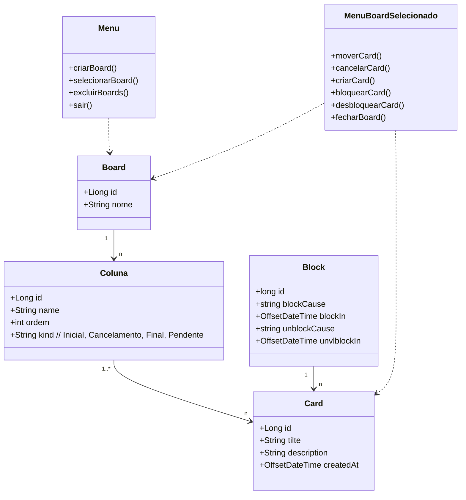

# Projeto BoardJava - DIO

Este repositório contém o código-fonte do projeto **BoardJava**, desenvolvido como parte do Bootcamp Decola Tech 2025 da [Digital Innovation One (DIO)](https://www.dio.me/). O projeto é uma aplicação de gerenciamento de tarefas (Task Board) desenvolvida em Java, utilizando conceitos de Programação Orientada a Objetos (POO) e boas práticas de desenvolvimento de software.

## 📋 Descrição do Projeto

O **BoardJava** é uma aplicação simples de gerenciamento de tarefas que permite aos usuários criar, visualizar, atualizar e excluir tarefas. O projeto foi desenvolvido para demonstrar a aplicação de conceitos fundamentais de Java, como classes, objetos, herança, polimorfismo e encapsulamento.
 
A aplicação permite que os usuários criem, visualizem, atualizem e excluam tarefas de forma intuitiva, simulando um quadro de tarefas (board) comum em ferramentas de produtividade. O projeto foi desenvolvido para ser executado no console, proporcionando uma experiência simples e direta para o usuário, enquanto mantém uma estrutura de código organizada e modular.

## 🎯 Funcionalidades Principais

- **Criação de Tarefas**: Os usuários podem adicionar novas tarefas, fornecendo um título, uma descrição e uma data de criação.
- **Visualização de Tarefas**: Todas as tarefas cadastradas são listadas em um formato organizado, exibindo detalhes como título, descrição, status e data de criação.
- **Atualização de Tarefas**: É possível editar o título, a descrição ou o status de uma tarefa existente.
- **Exclusão de Tarefas**: Tarefas podem ser removidas do sistema quando não são mais necessárias.
- **Menu Interativo**: Um menu no console guia o usuário pelas opções disponíveis, facilitando a interação com a aplicação.

## 📚 Objetivos de Aprendizado

Este projeto foi desenvolvido com foco educacional, visando consolidar os seguintes conceitos e práticas:

- **Programação Orientada a Objetos (POO)**: Uso de classes, objetos, herança, polimorfismo e encapsulamento.
- **Boas Práticas de Desenvolvimento**: Organização do código em pacotes, separação de responsabilidades e modularização.
- **Manipulação de Dados**: Gerenciamento de listas de objetos e operações CRUD (Create, Read, Update, Delete).
- **Interação com o Usuário**: Implementação de um menu interativo no console para facilitar a usabilidade.

## 🛠️ Tecnologias Utilizadas

- **Java**: Linguagem de programação principal utilizada no desenvolvimento do projeto.
- **Git**: Controle de versão para gerenciamento do código-fonte.
- **GitHub**: Plataforma de hospedagem de código para versionamento e colaboração.

## Diagrama de  Calsses

