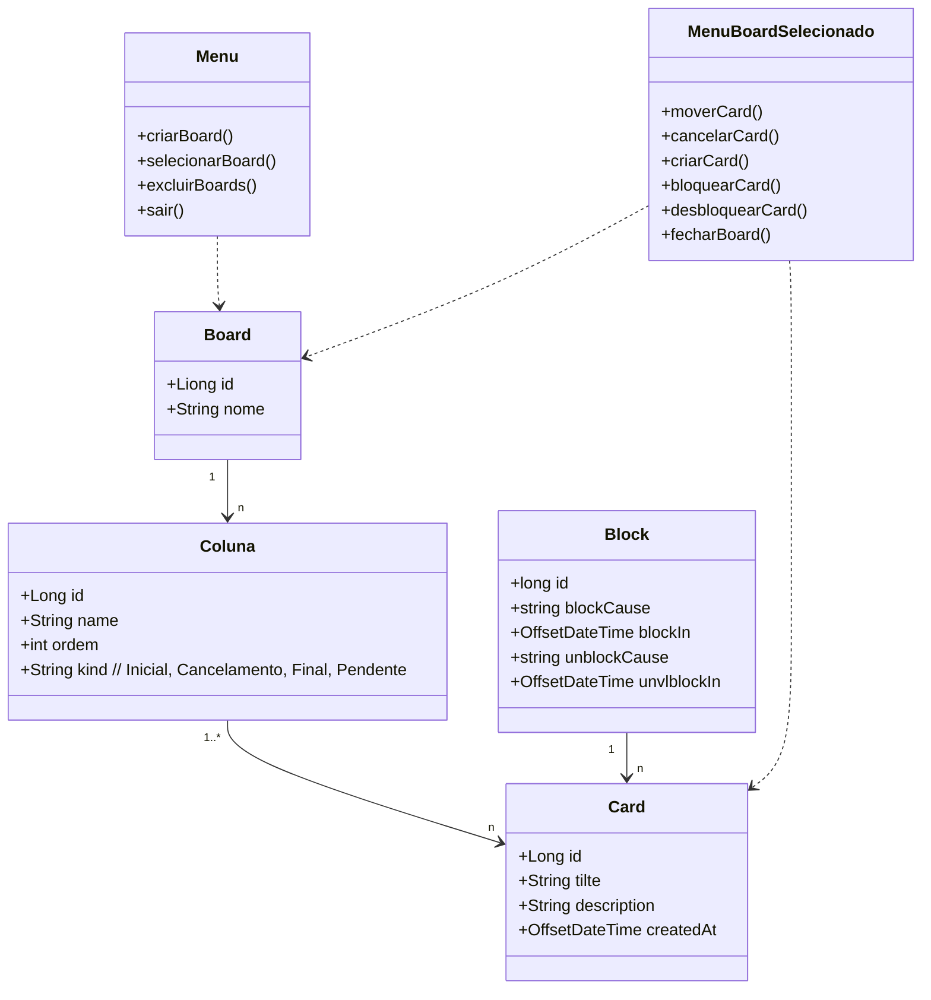

# Projeto BoardJava - DIO

Este repositório contém o código-fonte do projeto **BoardJava**, desenvolvido como parte do Bootcamp Decola Tech 2025 da [Digital Innovation One (DIO)](https://www.dio.me/). O projeto é uma aplicação de gerenciamento de tarefas (Task Board) desenvolvida em Java, utilizando conceitos de Programação Orientada a Objetos (POO) e boas práticas de desenvolvimento de software.

## 📋 Descrição do Projeto

O **BoardJava** é uma aplicação simples de gerenciamento de tarefas que permite aos usuários criar, visualizar, atualizar e excluir tarefas. O projeto foi desenvolvido para demonstrar a aplicação de conceitos fundamentais de Java, como classes, objetos, herança, polimorfismo e encapsulamento.

## 🛠️ Tecnologias Utilizadas

- **Java**: Linguagem de programação principal utilizada no desenvolvimento do projeto.
- **Git**: Controle de versão para gerenciamento do código-fonte.
- **GitHub**: Plataforma de hospedagem de código para versionamento e colaboração.

## Diagrama de  Calsses

